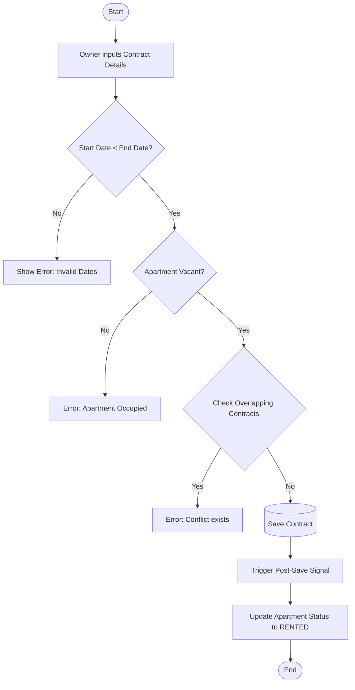
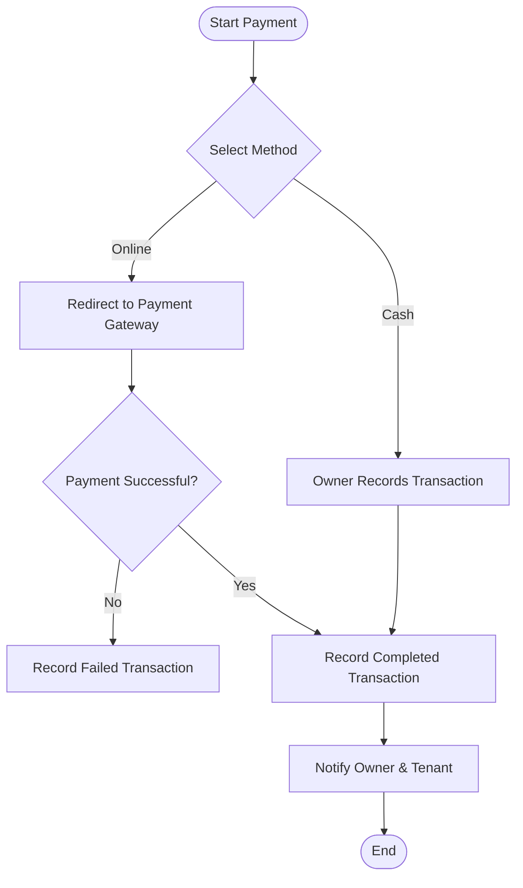
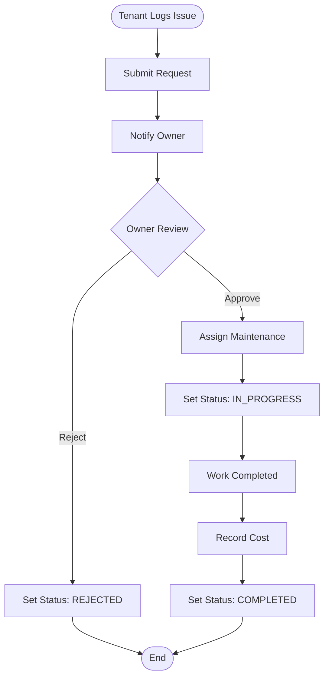

# Activity Diagrams

## 1. Contract Creation & Validation Flow

```mermaid
flowchart TD
    Start([Start]) --> Input[Owner inputs Contract Details]
    Input --> ValidateDate{Start Date < End Date?}
    ValidateDate -- No --> ErrorDate[Show Error: Invalid Dates]
    ValidateDate -- Yes --> CheckVacancy{Apartment Vacant?}
    
    CheckVacancy -- No --> ErrorVacant[Error: Apartment Occupied]
    CheckVacancy -- Yes --> CheckOverlap{Check Overlapping Contracts}
    
    CheckOverlap -- Yes --> ErrorOverlap[Error: Conflict exists]
    CheckOverlap -- No --> SaveDB[(Save Contract)]
    SaveDB --> Signal[Trigger Post-Save Signal]
    Signal --> UpdateApt[Update Apartment Status to RENTED]
    UpdateApt --> End([End])
```

## 2. Payment Processing Flow

```mermaid
flowchart TD
    Start([Start Payment]) --> SelectMethod{Select Method}
    SelectMethod -- Cash --> ManualRecord[Owner Records Transaction]
    SelectMethod -- Online --> GateWay[Redirect to Payment Gateway]
    
    GateWay --> Success{Payment Successful?}
    Success -- No --> Fail[Record Failed Transaction]
    Success -- Yes --> Complete[Record Completed Transaction]
    
    ManualRecord --> Complete
    Complete --> Notify[Notify Owner & Tenant]
    Notify --> End([End])
```

## 3. Maintenance Request Cycle

```mermaid
flowchart TD
    TenantStart([Tenant Logs Issue]) --> Submit[Submit Request]
    Submit --> NotifyOwner[Notify Owner]
    NotifyOwner --> OwnerReview{Owner Review}
    
    OwnerReview -- Reject --> RejectStatus[Set Status: REJECTED]
    OwnerReview -- Approve --> Job[Assign Maintenance]
    Job --> InProgress[Set Status: IN_PROGRESS]
    InProgress --> WorkDone[Work Completed]
    WorkDone --> AddCost[Record Cost]
    AddCost --> Close[Set Status: COMPLETED]
    
    RejectStatus --> End([End])
    Close --> End
```
