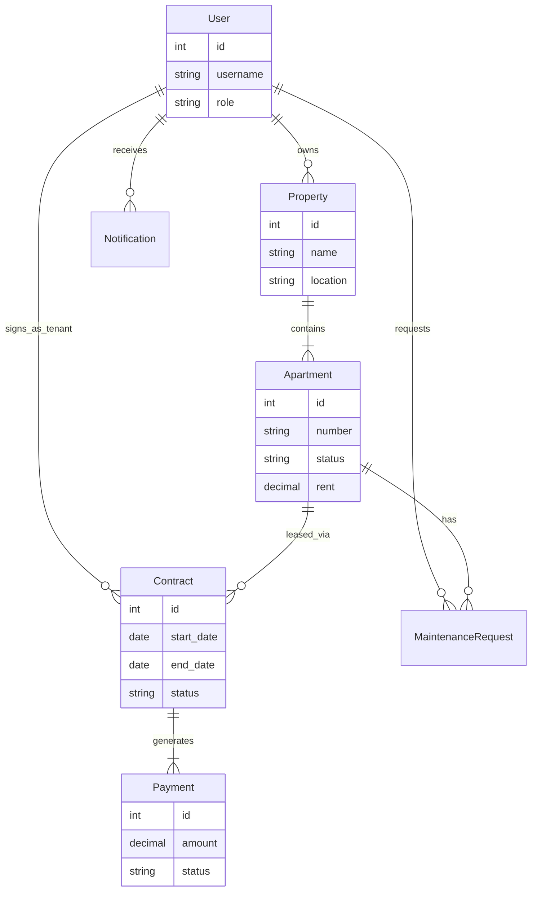

# Entity Relationship Diagram (ERD)

```mermaid
erDiagram
    User ||--o{ Property : owns
    User ||--o{ Contract : signs_as_tenant
    User ||--o{ MaintenanceRequest : requests
    User ||--o{ Notification : receives
    User {
        int id
        string username
        string role
    }

    Property ||--|{ Apartment : contains
    Property {
        int id
        string name
        string location
    }

    Apartment ||--o{ Contract : leased_via
    Apartment ||--o{ MaintenanceRequest : has
    Apartment {
        int id
        string number
        string status
        decimal rent
    }

    Contract ||--|{ Payment : generates
    Contract {
        int id
        date start_date
        date end_date
        string status
    }

    Payment {
        int id
        decimal amount
        string status
    }
```
