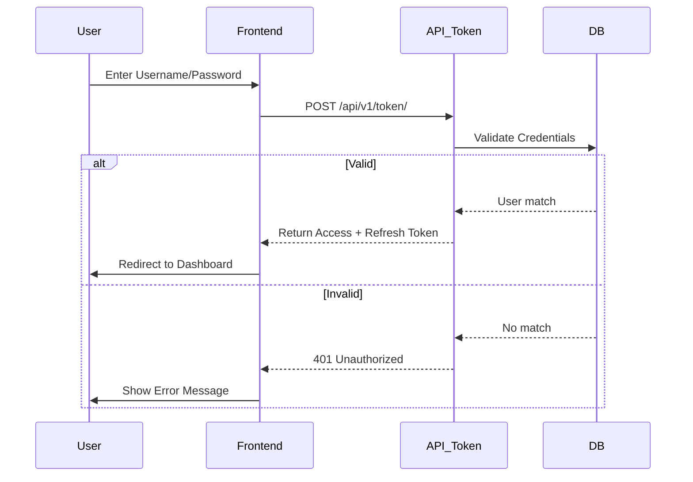
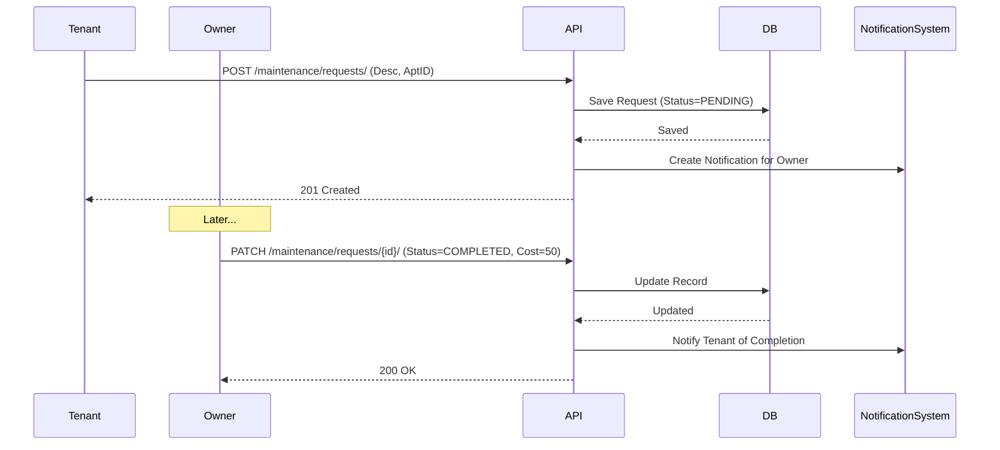
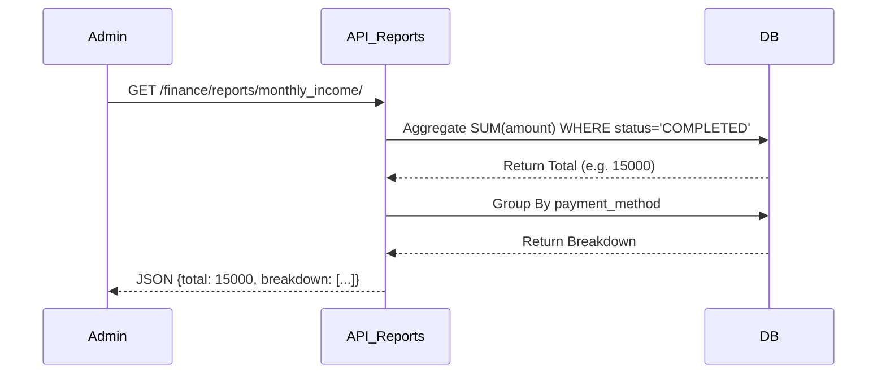

# Sequence Diagrams

## 1. User Authentication (Login)

```mermaid
sequenceDiagram
    participant User
    participant Frontend
    participant API_Token
    participant DB

    User->>Frontend: Enter Username/Password
    Frontend->>API_Token: POST /api/v1/token/
    API_Token->>DB: Validate Credentials
    alt Valid
        DB-->>API_Token: User match
        API_Token-->>Frontend: Return Access + Refresh Token
        Frontend->>User: Redirect to Dashboard
    else Invalid
        DB-->>API_Token: No match
        API_Token-->>Frontend: 401 Unauthorized
        Frontend->>User: Show Error Message
    end
```

## 2. Maintenance Request & Resolution

```mermaid
sequenceDiagram
    participant Tenant
    participant Owner
    participant API
    participant DB
    participant NotificationSystem

    Tenant->>API: POST /maintenance/requests/ (Desc, AptID)
    API->>DB: Save Request (Status=PENDING)
    DB-->>API: Saved
    API->>NotificationSystem: Create Notification for Owner
    API-->>Tenant: 201 Created

    Note over Owner: Later...
    Owner->>API: PATCH /maintenance/requests/{id}/ (Status=COMPLETED, Cost=50)
    API->>DB: Update Record
    DB-->>API: Updated
    API->>NotificationSystem: Notify Tenant of Completion
    API-->>Owner: 200 OK
```

## 3. Reporting (Monthly Income)

```mermaid
sequenceDiagram
    participant Admin
    participant API_Reports
    participant DB

    Admin->>API_Reports: GET /finance/reports/monthly_income/
    API_Reports->>DB: Aggregate SUM(amount) WHERE status='COMPLETED'
    DB-->>API_Reports: Return Total (e.g. 15000)
    API_Reports->>DB: Group By payment_method
    DB-->>API_Reports: Return Breakdown
    API_Reports-->>Admin: JSON {total: 15000, breakdown: [...]}
```
